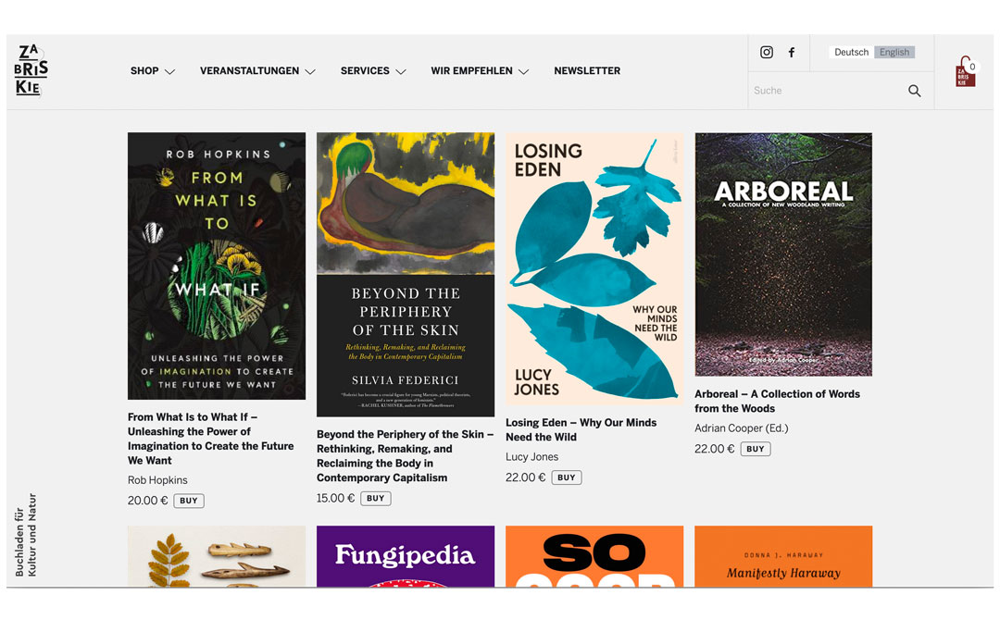

## El início
Libros, valores y personas capaces de entender la necesaria convivencia del diseño en todos los aspectos de su proyecto. Con esas cartas sobre la mesa, **involucrarme con Lore y Jean fue algo fácil**, sin discusión... una decisión que suponía un reto muy interesante para poder crecer y construir algo conjuntamente.

{{}}

Una de las partes más interesantes inicialmente era poder trabajar, desde el inicio, y con total libertad en la adaptación de la marca, [Maria Walnut](https://www.studiomariawalnut.com/) hizo un trabajo excelente para sentar los fundamentos básicos y el sistema que nos permitió crear toda la identidad digital en su sitio web.

Desde 2014, el proyecto ha ido escalando constantemente, de forma natural.
`Catálogo --> Blog --> Eventos --> Ecom --> PoS` 

Adaptamos el alcance del proyecto de forma constantemente. Teniendo en cuenta los tiempos, inversión y siempre midiendo el impacto que tiene para ellos cualquier decisión.

Hace unos meses renovamos un poco su aspecto, y hemos modernizado toda la estructura. Desde el primer *commit* allá por marzo del 2014, ha sido el segundo upgrade con más impacto en la marca y la plataforma. Sigue siendo Wordpress + Woocommerce, pero con una plantilla un poco más supervitaminada que nos ha permitido evaluar la forma en que mostrábamos la información y facilitábamos la venta. En esta última versión además hemos incorporado la sincronización con iZettle para las ventas en tienda, permitiendo tener el inventario mejor sincronizado y facilitar la experiencia de venta en la propia tienda.

Es un proyecto con un componente de riesgo bajo a nivel tecnológico, aunque totalmente adaptado a la oferta y capacidad de inversión.

<code>
Backend: Wordpress + WooCommerce 
Theme: Personalizado. SASS + Gulp 
Integraciones: iZettle en punto de venta 
</code>

Zabriskie trata de personas, de inquietudes y de compartir experiencias, ya sea en la propia tienda o en la web. Te da la opción de mantener la misma experiencia de compra en ambos contextos, cuidar la interacción para resolver dudas o ayudarte a conseguir una publicación.

Otro de esos proyectos de los me gusta hablar, que no tienen un despliegue tecnológico abrumador pero que ofrece resultados y métricas muy interesantes.

Gora Lore eta Jean! Porque mantienen la calidad de su negocio con muy pocas concesiones, porque saben sacar partido a sus limitaciones y porque siempre colaboran en invertir un poco más de tiempo, esfuerzo o dinero en mantener su identidad personal y de marca en cada paso que damos.

[Visíta su web, zabriskie.de](https://zabriskie.de)