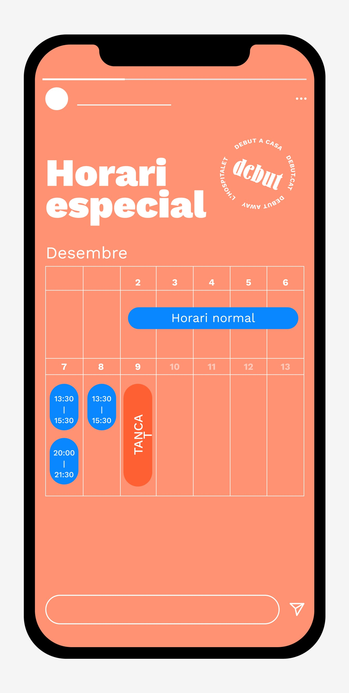
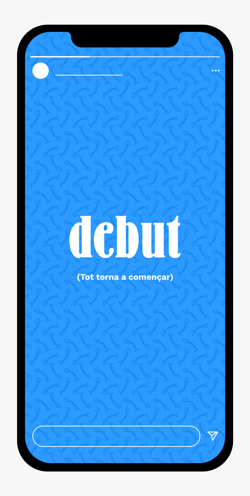
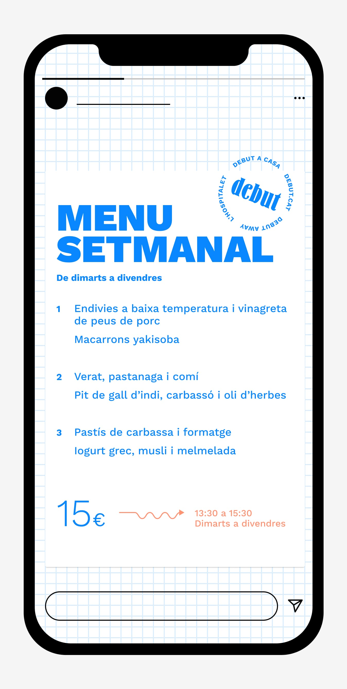
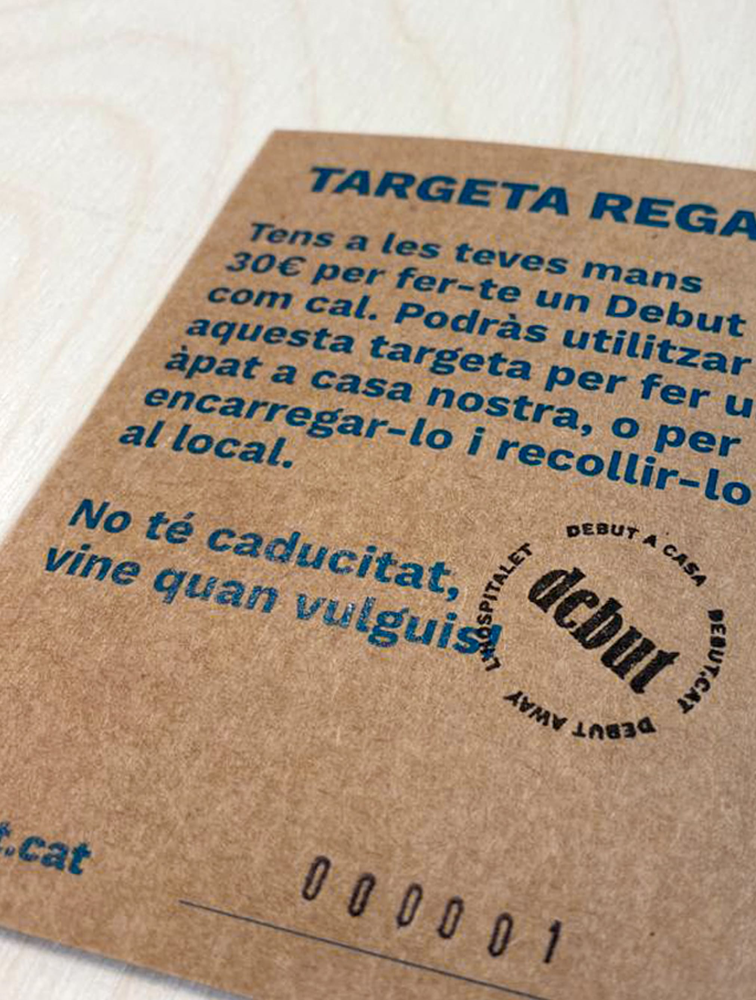
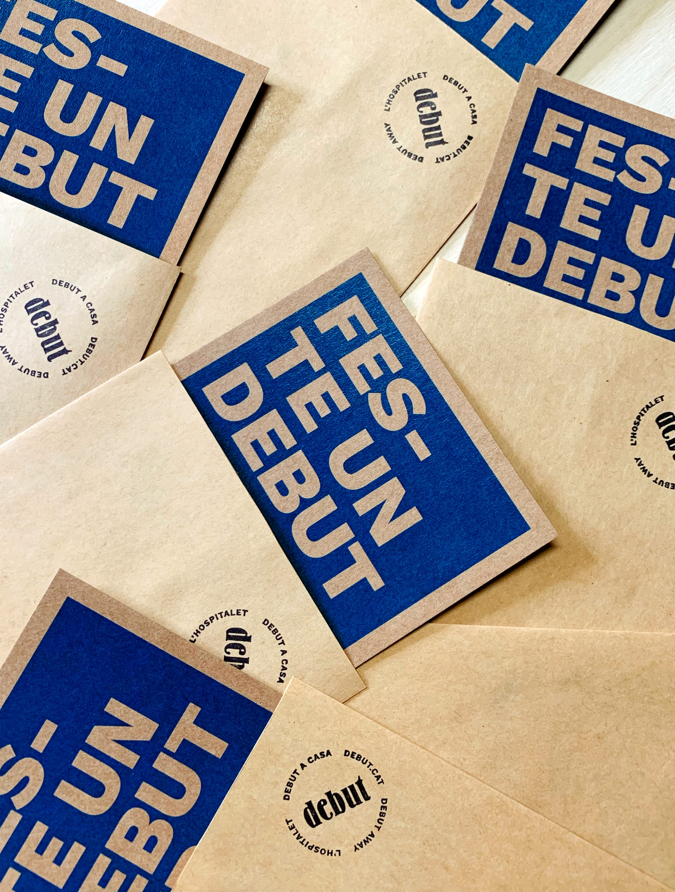
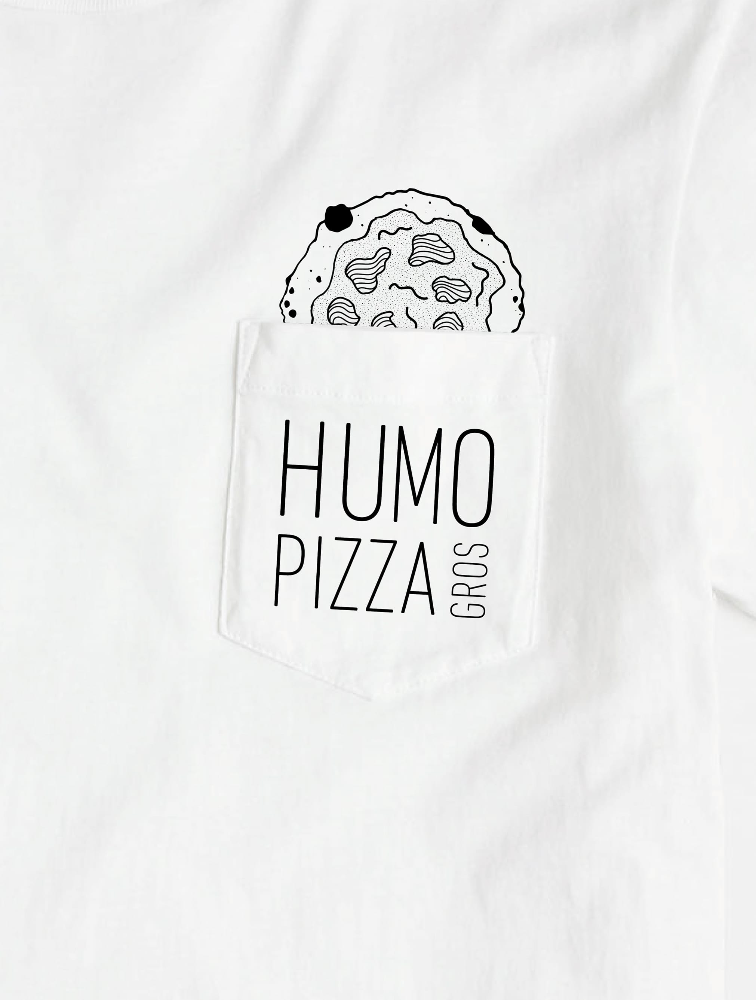
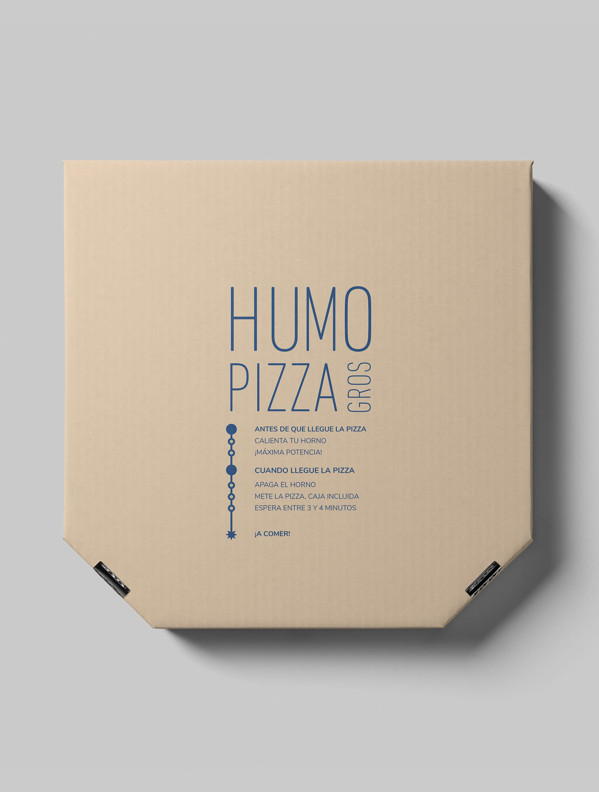

Aprender de mis clientes es una constante en mi trabajo, aprendo de todos, sin excepción. Pero aquellos que se mueven entre fogones tienen algo especial, me ofrecen la oportunidad de trasladar procesos, fórmulas y experiencias que enriquecen cada proyecto.

Esta es una pequeña muestra de algunos trabajos con ellos, ejemplos de comunicación adaptada a cada universo visual.

## Debut

Creo que es uno de los proyectos más "integrales" que tengo actualmente, una colaboración en toda regla. Ser participe de tomar decisiones en torno a la comunicación es algo muy gratificante, nos ayuda a crecer en torno a la audiencia a los resultados de las piezas gráficas que realizamos para redes sociales o la página web.

<figure class="gallery">
{{}}{{}}
</figure>

<iframe src="https://player.vimeo.com/video/504795908?title=0&byline=0&portrait=0" style="position:absolute;top:0;left:0;width:100%;height:100%;" frameborder="0" allow="autoplay; fullscreen; picture-in-picture" allowfullscreen></iframe>

<figure class="gallery">
{{}}{{}}
</figure>

[Si quieres conocer un poco más sobre el proyecto inicial, puedes leer este artículo.](https://www.ricardofelix.es/diseno/debut-restaurant/)

## Humo Pizza

PIZZA. Ya está, con eso era suficiente para convencerme en trabajar con ellos. Para redondear la propuesta, además de pizza, de pronto te encuentras con un proyecto genial con unas personas geniales detrás de ello. En este caso no he participado en la creación de la marca, pero poco a poco vamos trabajando en esa identidad en un tiempo extra-exigente con la forma de comunicar y proponer nuevas vías de trabajo en torno a la restauración y hostelería.

<iframe src="https://player.vimeo.com/video/504812789?autoplay=1&loop=1&title=0&byline=0&portrait=0" style="position:absolute;top:0;left:0;width:100%;height:100%;" frameborder="0" allow="autoplay; fullscreen; picture-in-picture" allowfullscreen></iframe>

<figure class="gallery">
{{}}{{}}
</figure>

<iframe src="https://player.vimeo.com/video/504807361?loop=1&title=0&byline=0&portrait=0" style="position:absolute;top:0;left:0;width:100%;height:100%;" frameborder="0" allow="autoplay; fullscreen; picture-in-picture" allowfullscreen></iframe>

[La web tiene humo... o lo parece.](https://humopizza.com/)

## Sta. Rita Experience

Qué cosa más bonita, el proyecto de Xabi Bonilla es una delicia. En este caso solo he trabajado la página web, un contexto en el que nos hemos permitido alguna licencia más experimental en torno a la estructura y la forma de navegar. Un contexto especial, una experiencia diferente, al igual que su propuesta culinaria.

<iframe src="https://player.vimeo.com/video/504807589?title=0&byline=0&portrait=0" style="position:absolute;top:0;left:0;width:100%;height:100%;" frameborder="0" allow="autoplay; fullscreen; picture-in-picture" allowfullscreen></iframe>

[Visita su web aquí.](https://santaritaexperience.com/)

### Créditos
Todas las imágenes son proyectos reales y han sido publicados con la autorización correspondiente.
El dibujo de Kevin es de [Ane Curto](https://www.instagram.com/anecurto/)