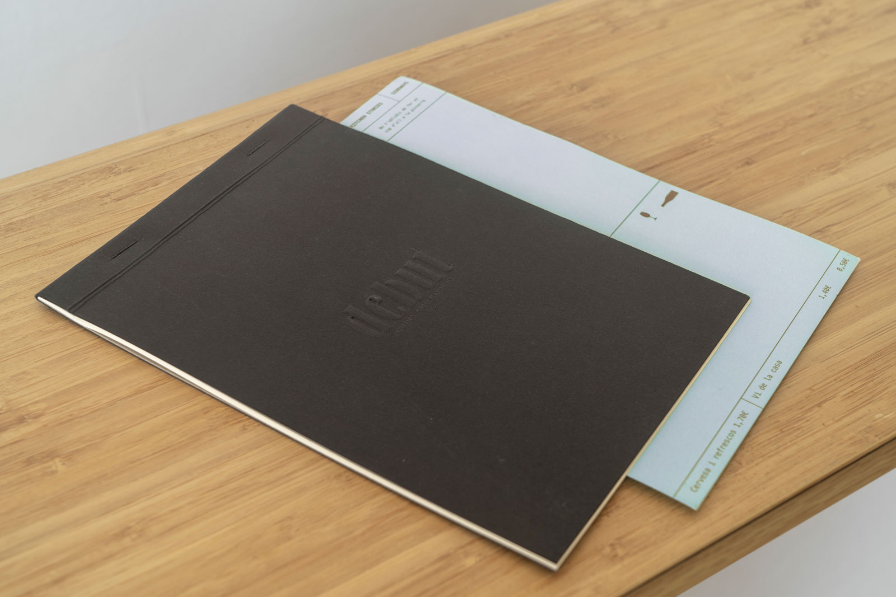

## Aguantame la birra

Es uno de esos proyectos que, después de la primera reunión de kick off, me tienen conquistado. Sobre todo si la reunión es tomando una cerveza con un perfecto desconocido y el proyecto todavía estaba en una fase con muchas incognitas por resolver.

Debut es un proyecto de identidad, de marca y de crecimiento, tanto digital como analógico. Siempre lo hemos abordado desde una perspectiva humilde, sabiendo las limitaciones de ambas partes y eso ha sido gran parte del éxito.

Una de esas grandes incógnitas era el nombre, nos esforzamos por buscar la mejor manera de buscar inspiración, democratizar los candidatos y buscar algo que hablase del proyecto, en todos sus sentidos. Ganó Debut, ahora se me hace raro que nunca tuvo ese nombre de entrada, pero que lo tenía en esencia.

## Identidad

La identidad es sencilla, con un sistema básico de representación de marca, pero cargada de personalidad en su aplicación. La clave era asociar nuestra pasión compartida por el arte, la música y evidentemente, la gastronomía, con efemerides, artistas o momentos que nos han marcado de alguna forma. Buscando siempre cual fue la primera vez de ese cocinero, artista o personaje que nos gustaría homenajear. Porqué Debut es un homenaje, a la cocina, al buen hacer y al trabajo duro para sacar adelante una pasión.

{{}} 

Todas las aplicaciones de marca, como posters, tarjetas de visita o publicaciones en redes sociales siempre intentan mantener este concepto, com dirian els meus amics catalans, "t'han recordes de la primera vegada?" con esa picardía que presta a que cada uno lo interprete como quiera, con esa incognita que nos hace pensar.

Debut tiene 3 años, crece, cambia, evoluciona y también lo hace su identidad. Desde el newsletter de todos los lunes que nos recuerda el menu de la semana, hasta los pequqeños guiños por Sant Jordi o Movember.

## I'm the man who loves you

Guillem y su familia entendiero que el proyecto era algo más que reuniones fuera de hora, algo más que decisiones compartidas o correcciones de mi pobre català. Entendiero que habían encontrado un colaborador con el que podían trabajar desde el entendimiento y la empatía. No se trata de hacer amigos, eso fué una consecuencia, se trata de confianza y de abrazar un proyecto cada día que pasa, es algo que no siempre sucede y que también es exigente, pero no cambiaría ni una palabra, ni un acuerdo, ni ninguno de los momentos de estos años por haber tenido una relación puramente profesional y cerrada a los códigos y condiciones que eso supone.

Nos lo seguiremos pasando bien.

[Visíta su web, debut.cat](https://debut.cat)
